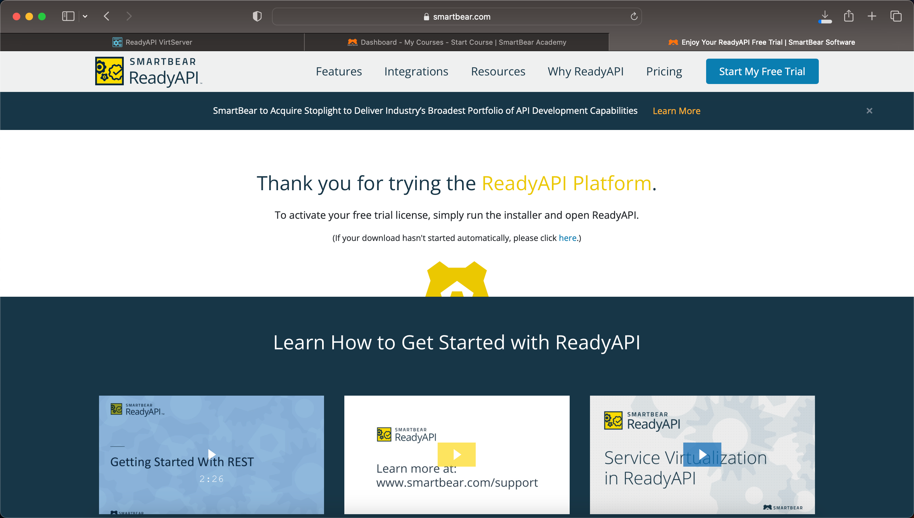

# virtdemo

This is an example on how to build a virtualization server usiing docker.

First you need to download the free license of ReadyAPI

https://smartbear.com/product/ready-api/free-trial/



Run the installer and select the option to install the license.

Mac will look like this


````bash

```bash
source .env
docker build -t virtdemo .
docker run -p 9090:9090 -p 8000-8100:8000-8100 -e SlmAccessKey=${SlmAccessKey} virtdemo
````

Open browser on http://localhost:9090/virtserver

<!-- IMG of server running -->


